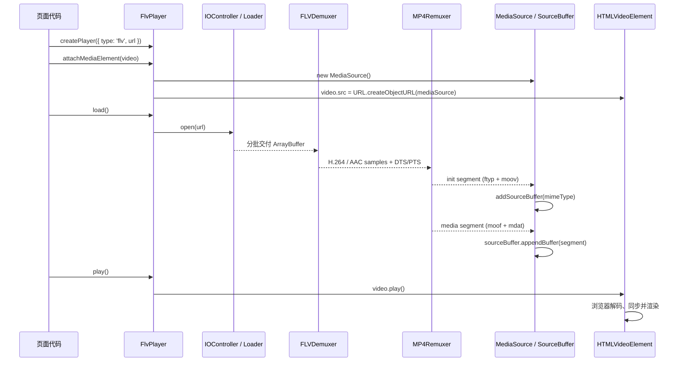

# flv.js 如何把 FLV 视频播放到页面

本文只解释一条主线：**一个 FLV 地址，经过 flv.js，最后为什么能在 HTML `<video>` 中播放。**

基于本项目安装的 `flv.js 1.6.2` 源码整理。日志、统计、跳转、懒加载、异常恢复、Worker 通信等非核心逻辑均被省略。

## 先记住结论

浏览器通常不能直接播放 FLV 容器，但可以通过 MSE（Media Source Extensions）播放分段 MP4。

flv.js 做的核心工作是：

```text
HTTP-FLV / WebSocket-FLV 字节流
              |
              v
      解析 FLV 容器（demux）
              |
              | 取出 H.264 视频帧、AAC/MP3 音频帧和时间戳
              v
  重新封装为 fragmented MP4（remux）
              |
              | init segment:  ftyp + moov
              | media segment: moof + mdat
              v
      SourceBuffer.appendBuffer()
              |
              v
       浏览器解码音视频帧
              |
              v
         <video> 显示画面
```

这里最重要的边界是：

- flv.js 负责下载、拆 FLV、重新封装和喂数据。
- 浏览器负责 H.264/AAC 解码、音画同步和页面渲染。
- flv.js 做的是 **转封装**，不是把 H.264 转码成另一种编码。
- `<video>` 的 `src` 最终不是 FLV 地址，而是一个指向 `MediaSource` 的 `blob:` URL。

## 最小使用方式

先看使用者能接触到的四个核心调用：

```html
<video id="video" controls></video>
```

```js
import flvjs from 'flv.js';

const video = document.querySelector('#video');

const player = flvjs.createPlayer({
  type: 'flv',
  url: 'https://example.com/live.flv',
  isLive: true
});

player.attachMediaElement(video);
player.load();

// 通常放在用户点击事件中，以满足浏览器自动播放策略。
await player.play();
```

四个调用的职责不要混在一起：

| 调用 | 真正发生的事 |
| --- | --- |
| `createPlayer()` | 根据 `type: 'flv'` 创建 `FlvPlayer`，还没有开始拉流 |
| `attachMediaElement(video)` | 创建 `MediaSource`，生成 `blob:` URL，并赋给 `video.src` |
| `load()` | 建立下载、解封装、重封装和 MSE 写入流水线，开始拉流 |
| `play()` | 基本等同于调用原生的 `video.play()` |

组件卸载时要释放资源：

```js
player.pause();
player.unload();
player.detachMediaElement();
player.destroy();
```

## 完整时序



下面逐段看每一步为什么存在。

## 1. `createPlayer()`：选择 FlvPlayer

入口在 `node_modules/flv.js/src/flv.js`：

```js
function createPlayer(mediaDataSource, config) {
  if (mediaDataSource.type === 'flv') {
    return new FlvPlayer(mediaDataSource, config);
  }
  return new NativePlayer(mediaDataSource, config);
}
```

这只是一个工厂函数。它根据媒体类型返回播放器对象，并没有在此时下载视频。

源码入口：

- [`src/flv.js`](../node_modules/flv.js/src/flv.js)
- [`src/player/flv-player.js`](../node_modules/flv.js/src/player/flv-player.js)

## 2. `attachMediaElement()`：搭起通往 `<video>` 的桥

这是“播放到页面”最关键的一步。其核心可以抽象成：

```js
class MSEBridge {
  attach(video) {
    this.video = video;
    this.mediaSource = new MediaSource();
    this.objectURL = URL.createObjectURL(this.mediaSource);
    video.src = this.objectURL;
  }
}
```

真实代码位于 `MSEController.attachMediaElement()`：

```js
const mediaSource = new MediaSource();
const objectURL = URL.createObjectURL(mediaSource);
video.src = objectURL;
```

`blob:` URL 在这里不是“已经下载完整的视频 Blob”。它只是让 `<video>` 关联到一个可持续追加数据的 `MediaSource` 对象。

此时还没有画面，也不一定已经开始下载。它只是建立了：

```text
JavaScript 持有的 MediaSource <----> 页面上的 <video>
```

相关源码：

- [`FlvPlayer.attachMediaElement()`](../node_modules/flv.js/src/player/flv-player.js#L131)
- [`MSEController.attachMediaElement()`](../node_modules/flv.js/src/core/mse-controller.js#L99)

## 3. `load()`：启动整条数据流水线

`FlvPlayer.load()` 创建 `Transmuxer`，并把它的两个输出接到 MSE：

```js
transmuxer.on('init_segment', (segment) => {
  mse.appendInitSegment(segment);
});

transmuxer.on('media_segment', (segment) => {
  mse.appendMediaSegment(segment);
});

transmuxer.open();
```

可以把 `Transmuxer` 理解为一个管道总控：

```text
Loader -> IOController -> FLVDemuxer -> MP4Remuxer
```

它既可以在主线程工作，也可以根据配置放到 Web Worker 中。是否使用 Worker 不改变数据处理主线。

相关源码：

- [`FlvPlayer.load()`](../node_modules/flv.js/src/player/flv-player.js#L187)
- [`Transmuxer`](../node_modules/flv.js/src/core/transmuxer.js)
- [`TransmuxingController`](../node_modules/flv.js/src/core/transmuxing-controller.js)

## 4. Loader：把网络响应变成连续的小块字节

普通 HTTP 地址优先使用 `FetchStreamLoader`。WebSocket 地址使用 `WebSocketLoader`。核心逻辑可以缩成：

```js
async function readStream(url, onChunk) {
  const response = await fetch(url);
  const reader = response.body.getReader();

  while (true) {
    const { done, value } = await reader.read();
    if (done) break;
    onChunk(value.buffer);
  }
}
```

因此直播不需要等一个 FLV 文件下载完。服务端每送来一块数据，后续流水线就能继续处理一块。

### `readStream()` 到底是怎么流式读的？

关键不在函数名，而在这两个 Web API：

```js
const response = await fetch(url);
const reader = response.body.getReader();
```

`fetch()` 的 Promise 在收到 HTTP 响应头时就可以 resolve，它不需要等整个响应体下载完成。响应体 `response.body` 是一个 `ReadableStream<Uint8Array>`，可以把它理解为“未来还会不断产生字节的管道”。

`getReader()` 会拿到这个管道的独占读取器。每调用一次：

```js
const { done, value } = await reader.read();
```

就等待下一批数据：

| 返回值 | 含义 |
| --- | --- |
| `done: false` | 还有数据，`value` 是这一批字节，类型通常是 `Uint8Array` |
| `done: true` | 服务端已经结束响应，没有下一批数据了 |

所以这段代码：

```js
while (true) {
  const { done, value } = await reader.read();
  if (done) break;
  onChunk(value.buffer);
}
```

实际过程类似：

```text
收到响应头
  |
  v
read() -> [第 1 批字节] -> onChunk()
  |
read() -> [第 2 批字节] -> onChunk()
  |
read() -> [第 3 批字节] -> onChunk()
  |
read() -> done: true -> 结束
```

它没有执行“先下载到一个大 Buffer，再交给解析器”的操作，而是每拿到一批就立即回调 `onChunk`。这就是流式读取。

### 为什么 `await reader.read()` 不会卡死？

`await` 只会暂停当前这个异步函数，不会阻塞浏览器主线程：

```js
const result = await reader.read();
```

如果网络还没送来下一批数据，函数暂时挂起；数据到达后，Promise resolve，函数从下一行继续执行。浏览器仍然可以处理页面渲染、用户点击和其他 JavaScript 任务。

### 网络 chunk 不等于 FLV Tag

这是阅读 flv.js 时特别容易误解的一点：

```text
read() 得到的 chunk：  [可能半个 Tag，也可能多个 Tag]
```

网络层只保证“给你一段当前收到的字节”，不保证 FLV 边界。例如一个 FLV Tag 可能被拆成：

```text
第 1 次 read():  Tag 头 + 一部分数据
第 2 次 read():  剩余数据 + 下一个 Tag
```

因此真实的 `IOController` 不会简单地把每个网络 chunk 当成一个完整 Tag，而是维护 stash buffer：

```js
function onNetworkChunk(chunk) {
  stash.append(chunk);

  while (stash.hasCompleteFlvTag()) {
    const tagBytes = stash.takeOneTag();
    demuxer.parseTag(tagBytes);
  }
}
```

如果当前只收到半个 Tag，就先缓存，等待下一次 `read()` 的数据拼接进来。只有确认数据足够解析出完整 Tag，才交给 `FLVDemuxer`。

`FLVDemuxer.parseChunks()` 自己也会返回本次实际消费了多少字节，剩余的半个 Tag 会留给后续数据继续拼接。这正是“流式解析”与“一次性解析完整文件”的区别。

### `readStream()` 为什么适合直播？

普通点播文件最终会出现 `done: true`；直播连接则可能长时间不结束：

```text
fetch() resolve（响应头到了）
  -> read() 收到一批
  -> read() 收到一批
  -> read() 收到一批
  -> ...
  -> 直播持续时通常不会 done: true
```

只要已经收到初始化信息和足够的媒体数据，flv.js 就可以边下载、边解封装、边生成 fMP4、边追加到 MSE；无需等待直播“结束”。

### 浏览器如何控制读取速度？

`ReadableStream` 自带背压（backpressure）机制。读取器和底层网络流之间不是无限制地把数据塞进内存：当消费方处理较慢、内部队列达到高水位时，浏览器会降低继续拉取的速度；消费方继续调用 `read()` 后，数据流再继续推进。

在 flv.js 中，后面还有两层节奏控制：

1. `IOController` 通过 stash buffer 拼接网络数据。
2. `MSEController` 通过 `SourceBuffer.updating` 和待写队列，避免在浏览器尚未处理完上一段时继续 `appendBuffer()`。

可以把它看成两道水闸：

```text
网络 -> stash buffer -> FLV Demux -> MP4 Remux -> MSE pending queue -> SourceBuffer
          拼接边界                                  等待 updateend
```

### 它和 flv.js 真实代码的对应关系

文档里的 `readStream()` 是为了便于理解的简化版。`flv.js` 1.6.2 的实际路径大致是：

```text
FetchStreamLoader._pump(reader)
  -> IOController._onLoaderChunkArrival(chunk, byteStart, receivedLength)
  -> IOController._dispatchChunks(...)
  -> TransmuxingController._onInitChunkArrival / demuxer.parseChunks()
```

真实 `_pump()` 的核心仍然是同一件事：

```js
reader.read().then(({ done, value }) => {
  if (done) {
    // 下载完成
    return;
  }

  const chunk = value.buffer;
  this._onDataArrival(chunk, byteStart, receivedLength);

  // 继续读取下一批
  this._pump(reader);
});
```

真实实现额外加入了 HTTP 状态检查、AbortController、Early EOF、Range、暂停/恢复和错误回调，但“每次 read 一批，立即向下游转交，再继续 read”就是它实现流式播放的核心。

真实实现还会处理 Range 请求、缓存拼接、暂停、网速统计、Early EOF 和浏览器兼容。理解播放主线时，可以先全部忽略。

相关源码：

- [`IOController`](../node_modules/flv.js/src/io/io-controller.js)
- [`FetchStreamLoader`](../node_modules/flv.js/src/io/fetch-stream-loader.js)
- [`WebSocketLoader`](../node_modules/flv.js/src/io/websocket-loader.js)

## 5. Demux：拆开 FLV 容器

FLV 是一个容器。简化后，它由文件头和连续的 Tag 组成：

```text
FLV Header
PreviousTagSize0
Tag 1
Tag 2
Tag 3
...
```

每个 Tag 有类型和时间戳。flv.js 关心三类：

| TagType | 内容 |
| --- | --- |
| `8` | 音频 |
| `9` | 视频 |
| `18` | 脚本元数据，例如时长和关键帧索引 |

`FLVDemuxer.parseChunks()` 的核心可以抽象为：

```js
function parseFlvChunk(buffer) {
  while (buffer 中还有完整的 FLV Tag) {
    const tag = readTagHeader(buffer);

    if (tag.type === 8) parseAudioTag(tag); // AAC / MP3
    if (tag.type === 9) parseVideoTag(tag); // H.264 NALU
    if (tag.type === 18) parseMetadata(tag);
  }

  emitSamples(audioTrack, videoTrack);
}
```

这一层会得到两类重要信息：

1. 轨道元数据，例如视频编码 `avc1...`、音频编码 `mp4a...`、分辨率、采样率。
2. 音视频 sample，例如 H.264 NALU、AAC frame，以及它们的 DTS/PTS、关键帧标记。

注意：这里只是从 FLV 包装中取出已经编码好的帧，没有把 H.264 解码成像素。

相关源码：

- [`FLVDemuxer.parseChunks()`](../node_modules/flv.js/src/demux/flv-demuxer.js#L268)
- [`FLVDemuxer._parseAudioData()`](../node_modules/flv.js/src/demux/flv-demuxer.js#L470)
- [`FLVDemuxer._parseVideoData()`](../node_modules/flv.js/src/demux/flv-demuxer.js#L823)

## 6. Remux：把编码帧包装成 fMP4

MSE 不接收任意格式的裸 H.264/AAC 数据。在 flv.js 的主流使用场景中，需要把 sample 重新包装为 fragmented MP4（fMP4）。

它会产生两种输出。

### 初始化段

```text
ftyp + moov
```

- `ftyp` 表示 MP4 文件类型与兼容品牌。
- `moov` 描述轨道、时间尺度、时长、编码参数等。
- 初始化段通常在拿到音频或视频的 sequence header 后生成。

### 媒体段

```text
moof + mdat
```

- `moof` 描述这一小段 sample 的时间、顺序、大小和关键帧信息。
- `mdat` 保存真正的 H.264/AAC 编码数据。
- 后续媒体数据会持续生成多个媒体段。

核心过程可以抽象为：

```js
function remux(trackMetadata, samples) {
  const initSegment = makeFtypAndMoov(trackMetadata);
  emitInitSegment(initSegment);

  for (const group of splitIntoFragments(samples)) {
    const mediaSegment = concat(
      makeMoof(group),
      makeMdat(group)
    );
    emitMediaSegment(mediaSegment);
  }
}
```

这里是 remux，不是 transcode：编码帧主体基本不变，变化的是外层容器和供浏览器使用的时间、索引描述。

相关源码：

- [`MP4Remuxer`](../node_modules/flv.js/src/remux/mp4-remuxer.js)
- [`MP4.generateInitSegment()`](../node_modules/flv.js/src/remux/mp4-generator.js#L149)
- [`MP4.moof()`](../node_modules/flv.js/src/remux/mp4-generator.js#L458)

## 7. MSE：把 fMP4 喂给浏览器

`MediaSource` 触发 `sourceopen` 后，flv.js 根据初始化段带来的 MIME 和 codec 创建 `SourceBuffer`：

```js
const mimeType = 'video/mp4;codecs=avc1.64001f';
const sourceBuffer = mediaSource.addSourceBuffer(mimeType);
```

音频轨道通常也会有自己的 `SourceBuffer`：

```js
const audioBuffer = mediaSource.addSourceBuffer(
  'audio/mp4;codecs=mp4a.40.2'
);
```

随后按顺序追加初始化段和媒体段：

```js
sourceBuffer.appendBuffer(initSegment);
sourceBuffer.appendBuffer(mediaSegment1);
sourceBuffer.appendBuffer(mediaSegment2);
```

真实代码不能像上面那样连续调用，因为 `appendBuffer()` 是异步操作。当 `sourceBuffer.updating === true` 时再次追加会报错，所以 flv.js 维护了待写入队列：

```js
function enqueue(segment) {
  pendingSegments.push(segment);
  appendNextIfIdle();
}

function appendNextIfIdle() {
  if (sourceBuffer.updating || pendingSegments.length === 0) return;
  sourceBuffer.appendBuffer(pendingSegments.shift());
}

sourceBuffer.addEventListener('updateend', appendNextIfIdle);
```

一旦数据进入 `SourceBuffer`，flv.js 的核心任务就结束了。浏览器媒体管线会读取缓冲区，完成解码、音画同步，并把画面绘制到 `<video>` 元素所在的页面区域。

相关源码：

- [`MSEController.appendInitSegment()`](../node_modules/flv.js/src/core/mse-controller.js#L168)
- [`MSEController.appendMediaSegment()`](../node_modules/flv.js/src/core/mse-controller.js#L225)
- `MSEController._doAppendSegments()` 中的 `SourceBuffer.appendBuffer()`

## 8. `play()`：让浏览器开始消费缓冲区

`FlvPlayer.play()` 没有复杂逻辑：

```js
play() {
  return this._mediaElement.play();
}
```

换句话说，flv.js 解决的是“如何让浏览器拿到可播放的数据”，而最终的播放状态仍然由原生 `<video>` 控制。

`load()` 和 `play()` 也是两件不同的事：

- `load()` 让网络与转封装流水线开始工作，数据进入 MSE 缓冲区。
- `play()` 让 `<video>` 从缓冲区取数据并播放。

浏览器通常禁止带声音的无用户操作自动播放，因此 `player.play()` 最稳妥的调用位置是点击事件。

## 把全流程压缩成一份代码

下面不是 flv.js 可运行源码，而是一份只表达架构的“骨架代码”：

```js
class TinyFlvPlayer {
  constructor(url) {
    this.url = url;
    this.pending = [];
  }

  attach(video) {
    this.video = video;
    this.mediaSource = new MediaSource();
    video.src = URL.createObjectURL(this.mediaSource);
  }

  async load() {
    await once(this.mediaSource, 'sourceopen');

    await readStream(this.url, (flvBytes) => {
      // 1. FLV -> 编码后的音视频 samples
      const { metadata, samples } = demuxFlv(flvBytes);

      // 2. samples -> fMP4
      const segments = remuxToFragmentedMp4(metadata, samples);

      // 3. 初始化轨道，并把 fMP4 放入 MSE
      for (const segment of segments) {
        if (!this.sourceBuffer) {
          this.sourceBuffer = this.mediaSource.addSourceBuffer(
            segment.mimeType
          );
          this.sourceBuffer.addEventListener('updateend', () => {
            this.appendNext();
          });
        }
        this.pending.push(segment.data);
        this.appendNext();
      }
    });
  }

  appendNext() {
    if (this.sourceBuffer.updating || this.pending.length === 0) return;
    this.sourceBuffer.appendBuffer(this.pending.shift());
  }

  play() {
    return this.video.play();
  }
}
```

真实 flv.js 将音频和视频分轨处理，并处理了流式数据跨 chunk 截断、时间戳修正、seek、缓冲区清理等问题。但它的骨架就是上面这几步。

## 一个容易混淆的概念图

```text
容器格式： FLV  -----------------------> fragmented MP4
             ^                                ^
             | flv.js 解析并重新封装          | MSE 接受的格式
             |                                |
编码格式： H.264 视频 + AAC/MP3 音频 ------> 编码内容基本不变
                                              |
                                              v
                                      浏览器硬件/软件解码
                                              |
                                              v
                                         像素与声音
```

所以“FLV 转 MP4”在这里不是把整个直播保存成 `.mp4` 文件，也不是重新编码画面，而是不断产生适合流式追加的 MP4 小片段。

## 当前项目中的实际情况

虽然 `package.json` 已安装 `flv.js`，但当前 `src` 中没有直接导入或调用它：

- `src/pages/17.直播/Live.vue` 使用 `vue3-video-play` 播放 MP4。
- `src/pages/17.直播/Live2.vue` 使用 `@liveqing/liveplayer-v3` 播放 HLS（`.m3u8`）。

也就是说，本文解释的是本项目 `node_modules/flv.js` 的工作原理，而不是这两个现有页面正在执行的播放链路。

如果要在 Vue 组件中真正接入 flv.js，最小骨架是：

```vue
<template>
  <video ref="videoRef" controls muted></video>
</template>

<script setup>
import { onBeforeUnmount, onMounted, ref } from 'vue';
import flvjs from 'flv.js';

const videoRef = ref();
let player;

onMounted(() => {
  if (!flvjs.isSupported()) return;

  player = flvjs.createPlayer({
    type: 'flv',
    url: 'https://example.com/live.flv',
    isLive: true
  });
  player.attachMediaElement(videoRef.value);
  player.load();
});

onBeforeUnmount(() => {
  if (!player) return;
  player.pause();
  player.unload();
  player.detachMediaElement();
  player.destroy();
});
</script>
```

## 阅读源码的推荐顺序

第一次阅读不要从所有文件逐行看。沿数据流看这 8 个点即可：

1. `src/flv.js`：`createPlayer()` 如何选中 `FlvPlayer`。
2. `src/player/flv-player.js`：`attachMediaElement()` 和 `load()` 如何组织上下游。
3. `src/core/mse-controller.js`：`MediaSource` 如何连接 `<video>`。
4. `src/core/transmuxing-controller.js`：IO、Demux、Remux 如何串起来。
5. `src/io/fetch-stream-loader.js`：网络数据如何一块块到达。
6. `src/demux/flv-demuxer.js`：FLV Tag 如何变成音视频 sample。
7. `src/remux/mp4-remuxer.js`：sample 如何变成 fMP4 segment。
8. 回到 `src/core/mse-controller.js`：segment 如何通过 `appendBuffer()` 进入浏览器。

读完后，用一句话复述整条链路：

> flv.js 流式下载 FLV，取出 H.264/AAC 编码帧，按时间戳重封装成 fMP4，通过 MSE 的 SourceBuffer 交给 `<video>`，最后由浏览器解码并显示。

## 能否成功播放的前提

即使代码流程正确，下面任一条件不满足也可能没有画面：

- 浏览器支持 MSE，并支持流中的具体音视频 codec。
- 常见 flv.js 视频链路是 H.264；HEVC/H.265 不能因为外层是 FLV 就自动获得浏览器支持。
- 直播服务正确输出 HTTP-FLV 或 WebSocket-FLV，并持续刷新数据。
- 跨域响应允许当前页面访问，即 CORS 配置正确。
- HTTPS 页面不能直接请求不安全的 HTTP 流，否则会被 Mixed Content 策略拦截。
- 自动播放必须符合浏览器策略，通常需要静音或用户手势。
